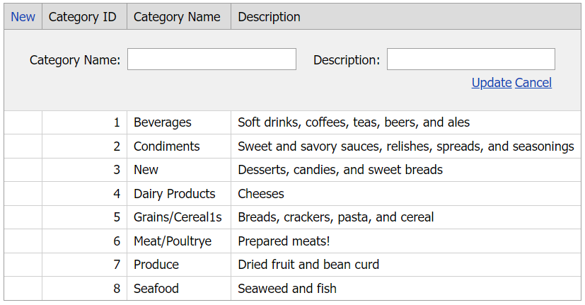

# Grid View for ASP.NET Web Forms - How to use batch mode to edit data and edit form mode to insert new rows
<!-- run online -->
**[[Run Online]](https://codecentral.devexpress.com/t191177/)**
<!-- run online end -->

This example demonstrates how to wrap a grid control in a callback panel and switch the grid's edit mode on the panel's callback.



## Overview

Follow the steps below to edit data in batch mode and insert new rows in edit form mode:

1. Create the [Grid View](https://docs.devexpress.com/AspNet/DevExpress.Web.ASPxGridView) control and wrap it with a callback panel. Specify a column's [HeaderTemplate](https://docs.devexpress.com/AspNet/DevExpress.Web.GridViewColumn.HeaderTemplate) property and add a hyper link editor to the template to create a custom **New** button.

    ```aspx
    <dx:ASPxCallbackPanel ID="ASPxCallbackPanel1" runat="server" ClientInstanceName="cp"
        OnCallback="ASPxCallbackPanel1_Callback">
        <PanelCollection>
            <dx:PanelContent runat="server">
                <dx:ASPxGridView ID="gridView" runat="server" AutoGenerateColumns="False" DataSourceID="ads"
                    ClientInstanceName="gridView" KeyFieldName="CategoryID" >
                    <ClientSideEvents EndCallback="OnEndCallback" />
                    <Columns>
                        <dx:GridViewCommandColumn ShowInCustomizationForm="True" ShowNewButtonInHeader="True">
                            <HeaderTemplate>
                                <dx:ASPxHyperLink ID="hlNew" runat="server" Text="New">
                                    <ClientSideEvents Click="hlNew_Click" />
                                </dx:ASPxHyperLink>
                            </HeaderTemplate>
                        </dx:GridViewCommandColumn>
                        <!-- ... -->
                    </Columns>
                    <SettingsEditing Mode="Batch" />
            </dx:PanelContent>
        </PanelCollection>
    </dx:ASPxCallbackPanel>
    ```

2. Create a flag variable, handle the button's `Click` event, and do the following in the handler:

   * Call the grid's [HasChanges](https://docs.devexpress.com/AspNet/js-ASPxClientGridViewBatchEditApi.HasChanges) method to indicate whether the grid has unsaved changes.
   * Call the grid's [UpdateEdit](https://docs.devexpress.com/AspNet/js-ASPxClientGridView.UpdateEdit) method to save changes.
   * Call the panel's `PerformCallback` method to send a callback to the server.
   * Use a hidden field control to save the flag variable value.

    ```js
    var isNewClicked = false;
    function hlNew_Click(s, e) {
        if (gridView.batchEditApi.HasChanges()) {
            if (confirm("All changes will be saved automatically. Do you want to continue?"))
                gridView.UpdateEdit();
            isNewClicked = true;
        }
        else {
            hf.Set("isNewClicked", true);
            cp.PerformCallback();
        }
    }
    ```

    ```aspx
    <dx:ASPxHiddenField ID="hf" runat="server" ClientInstanceName="hf" />
    ```

3. Handle the panel's server-side `CustomCallback` event. In the handler, set the grid's [Mode](https://docs.devexpress.com/AspNet/DevExpress.Web.ASPxGridViewEditingSettings.Mode) property to `Batch` or `EditForm` based on the flag variable value. To insert new rows in edit form mode, call the grid's [AddNewRow](https://docs.devexpress.com/AspNet/js-ASPxClientGridView.AddNewRow) method.

    ```csharp
    protected void ASPxCallbackPanel1_Callback(object sender, DevExpress.Web.CallbackEventArgsBase e) {
        if (hf.Contains("isNewClicked")) {
            if ((bool)hf.Get("isNewClicked") == true) {
                gridView.SettingsEditing.Mode = DevExpress.Web.GridViewEditingMode.EditForm;
                hf.Set("isNewClicked", false);
                gridView.AddNewRow();
            }
            else
                gridView.SettingsEditing.Mode = DevExpress.Web.GridViewEditingMode.Batch;
       }
    }
    ```

## Files to Review

* [Default.aspx](./CS/Default.aspx) (VB: [Default.aspx](./VB/Default.aspx))
* [Default.aspx.cs](./CS/Default.aspx.cs) (VB: [Default.aspx.vb](./VB/Default.aspx.vb))

## Documentation

* [Edit Data in Grid](https://docs.devexpress.com/AspNet/3712/components/grid-view/concepts/edit-data)
